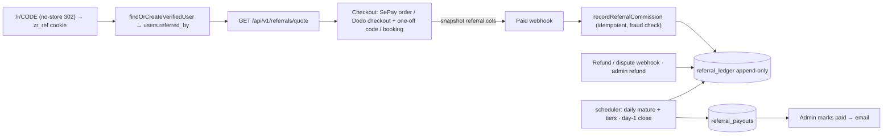

# Referral program

Accepted outcome, constraints and non-goals come from the confirmed advise session (handoff brief below is authoritative). Research: [Dodo discount/refund APIs](../reports/researcher-261009-1416-dodo-discount-refund-apis.md).

## Locked decisions

- R = max(admin override, tier rate). Tiers on successful referrals in the last 90 days: 0/3/10/25/50 → 20/25/30/40/50 % (admin-editable table).
- One link + one discount `d` per referrer (integer, 0 ≤ d ≤ R; clamped to R at use). Commission = R − d.
- Booking: total 10 %, split by d/R (discount = round(10·d/R), commission = 10 − discount).
- Commission only on referee's first paid order of any kind; discount stacks after prepay discount; commission on amount actually collected.
- Referrers: members with an active plan, or accounts admin-enabled. Link paused while plan lapsed; earned commissions stay payable.
- Attribution binds permanently on account creation (30-day `zr_ref` cookie); checkout code entry if not bound.
- Hold 30 days (booking: 30 days after `slot_end`). Refund/dispute → reversal; after payout → negative ledger line deducted next close.
- Fraud: hard block (self-referral, previously paid referee, locked referrer) / soft → `review` queue.
- Payout: day-1 close, threshold $50, VN bank −10 % ("Thuế TNCN"), PayPal −18 % ("Phí xử lý & thuế"), rates configurable; admin pays manually days 1–10 and marks paid with ref.
- VN tax profile: CCCD images in private R2 only until admin approves, then deleted in the same request.
- Leaderboard: monthly top 10, public, masked names, opt-out, ranked by paid referred orders in month minus reversed/blocked; no money.
- Ledger in USD cents; SePay VND orders converted at the order's stored `usd_vnd_rate`; payout VND at `USD_VND_RATE` at close.

## Phases

| # | Phase | Status | Depends on |
|---|-------|--------|-----------|
| 1 | [Schema, config, rates and ledger core](phase-01-schema-rates-ledger.md) | completed | — |
| 2 | [Attribution and referee eligibility](phase-02-attribution-eligibility.md) | completed | 1 |
| 3 | [Discounted checkout: SePay, Dodo, booking](phase-03-discounted-checkout.md) | completed | 2 |
| 4 | [Commission capture, fraud checks, refunds and reversals](phase-04-commissions-fraud-refunds.md) | completed | 3 |
| 5 | [Cron: maturity, tiers, monthly close; payout profiles and R2](phase-05-cron-payouts-profiles.md) | completed | 4 |
| 6 | [REST, OpenAPI and MCP surfaces](phase-06-rest-openapi-mcp.md) | completed | 5 |
| 7 | [UI: Zuey OS referral app, leaderboard, checkout and admin](phase-07-ui-os-app-admin.md) | pending | 6 |
| 8 | [Docs, remote migration, verification and PR](phase-08-docs-deploy-verify.md) | pending | 7 |

Phases are sequential (shared files: billing.ts, dodo-billing.ts, booking/store.ts, registries).

## Architecture

Module: `src/lib/referrals/` — `config.ts`, `rates.ts`, `codes.ts`, `attribution.ts`, `checkout.ts`, `commissions.ts`, `fraud.ts`, `refunds.ts`, `jobs.ts`, `payouts.ts`, `payout-profiles.ts`, `leaderboard.ts`, `openapi.ts`, `mcp.ts`. Migration `migrations/0014_referrals.sql`.

## Acceptance (Done means)

1. Migration 0014 applied to remote D1 (Time Travel bookmark recorded first).
2. Paying member sees link + split slider in the Referral app; referee via link pays discounted price on SePay, Dodo and booking.
3. Tests: paid order → one pending commission (webhook retry idempotent); 30 days → approved; refund → reversed; post-payout refund → negative line deducted next close; self-referral/previously-paid → none; soft signal → review; 3 successes in 90 days → R = 25 %.
4. Day-1 close: correct 10 %/18 % deductions, $50 threshold, admin mark-paid with ref.
5. CCCD images deleted from R2 on approval (tested).
6. Leaderboard top 10, masked names, opt-out.
7. REST/OpenAPI + MCP admin tools registered; `bun test` and `bun run build` pass; README + `docs/env-setup.vi.md` updated.

## Out of scope

Recurring commissions, multiple links per referrer, automated PayPal payouts, automated tax filing, top-3 prizes, multi-level referrals.

## Stop and ask only if

Dodo cannot apply a one-off percentage discount to the first subscription cycle (verify in test mode in phase 3); accountant changes deduction rules; remote migration needs data rewriting beyond adding tables/columns; an unexplained failure.

## Risks

- Dodo `allow_discount_code: false` may ignore server-passed codes → verify with `POST /checkouts/preview`; fallback: set flag true (field visible, code pre-applied).
- Dodo webhook currently flags `payment.succeeded` below list price as attention (`dodo-billing.ts:366`) → must compare against the snapshotted expected amount.
- `/pricing` is publicly cached → discounted price fetched client-side via quote API; server recomputes at order creation (never trusts client).
- Cached pages must never emit `Set-Cookie` → attribution cookie only from the `/r/{code}` no-store redirect.
- Validation gate: every decision question was already answered in the advise interview; no new user questions raised.
- PayPal handler treats every `PAYMENT.CAPTURE.*` as capture → split refund/reversal branch.
